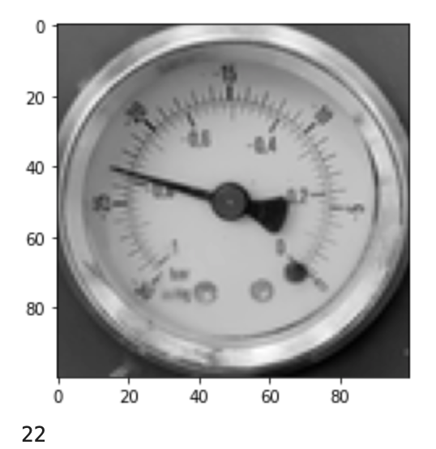

# Simple CNN Needle Value Predictor/Regression
This project shows an example of how to use a Keras model to implement regression using a simple CNN for images.

## Installation
1. Pull the code
2. Create a Python environment and activate it

*e.g.* 
`virtualenv -p python3 .venv`
`source .venv/bin/activate`

3. Install requirements

*e.g.*

4. There are 2 notebooks (main.ipynb, augment_needle/augment_needle.ipynb), one for the training process and the other one for the image augmentation process (the other 2 notebooks, reference_xxx.ipynb are just used as reference for the main implementation)

- The augmentation is done by using the [Augmentor](https://github.com/mdbloice/Augmentor) package

5. To generate the images, run the generator notebook and copy the files from *augment_needle/images* into *dataset_xxx/*

The regression predicts the value of the needle
*e.g.*
